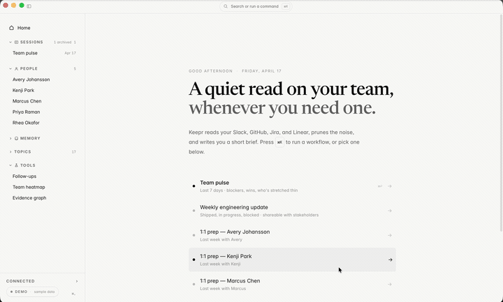

<p align="center">
  
</p>

<p align="center">
  <strong>AI memory layer for engineering managers. Local-first. No backend. No account.</strong>
</p>

<p align="center">
  <a href="https://github.com/keeprhq/keepr/blob/main/LICENSE"></a>
  <a href="https://github.com/keeprhq/keepr/actions/workflows/ci.yml"></a>
  <a href="https://github.com/keeprhq/keepr/releases/latest"></a>
</p>

---

Keepr is a desktop app that turns your team's Slack and GitHub exhaust into cited weekly briefs and 1:1 prep. It runs on your laptop -- your data never touches a middleman server.

Point it at your Slack workspace and a handful of GitHub repos, pick an LLM provider, and Keepr produces an evidence-backed team pulse or 1:1 prep in about a minute. It is a desktop app, not a SaaS. No backend, no account, no analytics.

## Demo

<p align="center">
  
</p>

## Features

- **Team pulse** -- Monday-morning read of what happened across your team last week, evidence-backed and cited
- **1:1 prep** -- Context for an upcoming 1:1 with recent work, open threads, and follow-up items
- **Weekly engineering update** -- Stakeholder-ready summary: shipped, in progress, blocked, upcoming
- **Performance evaluation** -- Evidence-organized eval with optional rubric mapping (scaffold, needs real-data tuning)
- **Promo readiness** -- Gap analysis against target level with cited evidence
- **Local memory** -- Observed facts persisted as plain markdown files you can open in Obsidian, grep, or commit to a private repo
- **Keyboard-first UI** -- Command palette (Cmd+K), citation scroll, session history
- **Zero telemetry** -- Nothing phones home. Keepr cannot see your sessions.

## Tech Stack

| Layer | Technology |
|-------|-----------|
| Desktop shell | [Tauri 2](https://v2.tauri.app/) (Rust) |
| Frontend | React 19, TypeScript, Tailwind CSS |
| Database | SQLite via `tauri-plugin-sql` |
| Secrets | macOS Keychain via `keyring` crate |
| LLM providers | Anthropic, OpenAI, OpenRouter, or any OpenAI-compatible endpoint |
| Data sources | Slack Web API, GitHub REST API, Jira Cloud, Linear GraphQL |
| Build | Vite, Cargo |

## Quickstart

You need **Node 20+**, **Rust (stable)**, and **npm**.

```bash
git clone https://github.com/keeprhq/keepr.git
cd keepr
npm install
npx tauri dev
```

That launches the Tauri window with Vite HMR. First run walks you through:

1. Pick an LLM provider (Anthropic, OpenAI, OpenRouter, or custom) and paste an API key
2. Create a Slack app from the provided manifest and paste its bot token
3. Connect GitHub (PAT is fastest; device flow works once you register an OAuth app)
4. Optionally connect Jira and/or Linear
5. Add team members (display name, GitHub handle, Slack user ID)
6. Pick a memory directory (defaults to `~/Documents/Keepr`)
7. Read and acknowledge the privacy posture

Then press Cmd+K and run `team pulse`, or type a team member's name for 1:1 prep.

### Building a standalone binary

```bash
npx tauri build --debug --no-bundle
./src-tauri/target/debug/keepr
```

## Architecture at a Glance

```
fetch  ->  prune  ->  Haiku map  ->  Sonnet reduce  ->  write memory
```

- **`src-tauri/`** -- Thin Rust shell. SQLite bridge, OS keychain bridge (`secrets.rs`), atomic file I/O with lock (`fs_atomic.rs`). No OAuth callback server, no background workers.
- **`src/services/`** -- TypeScript business logic. DB, secrets, GitHub, Slack, Jira, Linear, LLM providers, the map/reduce pipeline, and the memory layer.
- **`src/prompts/`** -- Prompt templates as plain markdown files, imported via `?raw`. Tune them by editing the file and reloading.
- **`src/components/` and `src/screens/`** -- React 19 UI. Command-palette-first navigation, keyboard shortcuts, bidirectional citation scrolling.
- **`~/Documents/Keepr/`** (or wherever you pointed it) -- Canonical memory. Plain markdown files you can open in Obsidian, grep, or commit to a private repo. Keepr's SQLite is metadata only; the memory itself is files on disk.

Evidence items get stable `ev_N` IDs. The LLM cites by ID only; the app resolves IDs to URLs at render time. Memory files persist observed facts only -- interpretations live in the session file for that run and never get appended to memory.

## Privacy Posture

The honest version:

- **Keepr operates no servers.** There is no backend, no analytics, no telemetry. Keepr cannot see your sessions.
- **Your data still leaves your laptop in two specific ways:**
  1. To Slack and GitHub (and optionally Jira/Linear) -- the original sources. You already trust them with this data.
  2. To whichever LLM provider you configured. Raw Slack message content and PR descriptions flow into their API for synthesis. This is the main remaining trust surface.
- **What local-first buys you:** no middleman vendor holds your data. The number of parties who see your content is two instead of three. Your team's data is never pooled with other customers'.
- **What it does not buy you:** it does not eliminate the LLM provider from your trust model. If your company forbids sending Slack messages to Anthropic or OpenAI, Keepr cannot help you in v1.

Read the full version in [`PRIVACY.md`](./PRIVACY.md) before you connect a real work Slack.

## Roadmap

v1 is team pulse plus 1:1 prep on macOS. v1.5 brings weekly engineering updates, Windows and Linux, and auto-update. v2 is the rubric-aware performance and promo work. See [`ROADMAP.md`](./ROADMAP.md) for the full picture -- v2 features are planned, not promised.

## Contributing

This is a dogfood-first project. Before opening a PR, read [`CONTRIBUTING.md`](./CONTRIBUTING.md). The short version: use the app on real data for at least one session before proposing changes to prompts or pipeline behavior.

Please also review our [`CODE_OF_CONDUCT.md`](./CODE_OF_CONDUCT.md).

## Security

If you discover a security vulnerability, please report it responsibly. See [`SECURITY.md`](./SECURITY.md) for the process and what's in scope.

## License

MIT. See [`LICENSE`](./LICENSE).

---

<p align="center">
  Built with Tauri, React, and TypeScript
</p>
