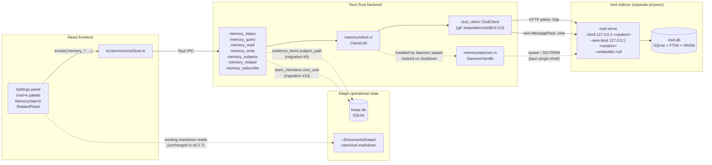

# ctxd memory layer topology (v0.2.7+)

How memory data flows through Keepr after v0.2.7 lands.

## Process layout



## Key invariants

1. **Frontend never touches ctxd directly.** Every call goes through a Tauri command in `src-tauri/src/memory/mod.rs`. The Rust backend owns the SDK client, the capability tokens (in v0.3.0+), and error normalization.

2. **Two SQLite databases, linked by string identifiers.**
   - `keepr.db` — mutable operational state (sessions, secrets, followups, fetch_cache, app_config). Managed by `tauri-plugin-sql` migrations 1–10.
   - `ctxd.db` — append-only event log + FTS5 + HNSW (lazy). Managed by ctxd itself; never touched by Keepr's Rust code directly.
   - Bridge: `evidence_items.subject_path` (migration #9) carries a ctxd subject path so the UI can pivot from a Keepr citation to the canonical ctxd event.

3. **Markdown stays canonical.** ctxd is a derived index. v0.2.7 dual-writes (markdown + ctxd event) for new sessions, person facts, topic notes, follow-ups. Reads still come from markdown in `pipeline.ts` until v0.4 swaps the prompt-builder to `memory_query`.

4. **Random per-user loopback ports.** `127.0.0.1:0` → kernel-assigned ephemeral ports, persisted to `app_config.memory.{http_port,wire_port}` on first launch. No external network exposure.

5. **Bundled, never installed separately.** The ctxd binary lives inside `Keepr.app` via `tauri.conf.json` `bundle.externalBin`. End users never know it exists.

## Lifecycle

```
App start
  → Tauri setup hook (lib.rs)
    → app.manage(DaemonHandle::new())
    → spawn task: memory::spawn(app_handle, daemon_handle)
        → memory/ports.rs: allocate fresh ephemeral ports
        → tauri-plugin-shell: spawn `ctxd serve --bind ... --wire-bind ... --db ... --embedder null`
        → poll http://127.0.0.1:<port>/health every 100ms (timeout 5s)
        → on 200 OK:
            → ClientCell::install(http_addr, wire_addr) — builds CtxdClient + wire connection
            → DaemonState::Ready { http_port, wire_port }
        → on timeout/failure:
            → kill child, ClientCell::clear()
            → DaemonState::Offline { reason }
            → frontend Settings panel renders red dot

Window close
  → on_window_event(CloseRequested)
    → memory::shutdown(daemon_handle)
        → child.kill() (SIGTERM)
        → ClientCell::clear()
        → DaemonState::Offline { reason: "shutdown" }
```

## Command surface (v0.2.7 PR 2)

| Tauri command | SDK method | Status |
|---|---|---|
| `memory_status` | (local state read) | ✅ |
| `memory_write` | `client.write` | ✅ |
| `memory_read` | `client.query(QueryView::Log)` | ✅ |
| `memory_query` | `client.query(QueryView::Fts)` | ✅ FTS-only until embedder lands |
| `memory_subjects` | n/a — SDK lacks it | ⏳ `NotYetSupported` until v0.4 SDK |
| `memory_related` | n/a — SDK lacks it | ⏳ `NotYetSupported` until v0.4 SDK |
| `memory_subscribe` | `client.subscribe` (stubbed) | ⏳ Real wiring once v0.4 SDK exposes EventStream |

## UI surfaces (v0.2.7 PRs 5–11)

```mermaid
graph TD
    cmdk["⌘K palette<br/>(CommandPalette.tsx + memory section)"]
    search["MemorySearch.tsx<br/>(filter chips: source, range, person)"]
    related["RelatedPanel.tsx<br/>(right edge, opens on subject click)"]
    sidebar["ActivitySidebar.tsx<br/>(default-collapsed, subscribe stub)"]
    person["PersonDetail.tsx<br/>(memory-layer section below facts)"]
    pulse["SessionReader.tsx<br/>(citation chips → RelatedPanel)"]
    banner["MemoryFirstLaunchBanner.tsx<br/>(once per install)"]

    cmdk -->|memory_query| search
    search -->|onOpenSubject| related
    person -->|memory_read| related
    pulse -->|subject_path → onOpenRelated| related
    related -->|memory_related (NotYetSupported in v0.2.7)| related
    sidebar -.->|memory_subscribe (stub in v0.2.7)| sidebar
    banner -.->|memory_status| banner
```

| Surface | PR | Tauri commands used |
|---|---|---|
| Memory layer Settings panel | PR 1 | `memory_status` |
| ⌘K palette memory section | PR 5 | `memory_query` |
| MemorySearch screen | PR 6 | `memory_query` |
| RelatedPanel | PR 8 | `memory_related` (NYS) |
| SessionReader citation chips | PR 10 | (uses subject_path; opens RelatedPanel) |
| PersonDetail memory section | PR 7 | `memory_read` |
| ActivitySidebar | PR 9 | `memory_subscribe` (stub) |
| First-launch banner | PR 11 | `memory_status` |
| Evidence dual-write | PR 4 | `memory_write` (via pipeline) |
| Session/topic/person dual-write | PR 3 | `memory_write` (via memory.ts) |

## What's NOT in scope here

- **External MCP exposure** — v0.3.0 ships a Settings toggle that mints a biscuit and opens an `--mcp-http` port for external agents (Claude Code, Cursor). Today the daemon's MCP transports are unbound.
- **Federation** — ctxd has it; deferred to v0.5+.
- **Hybrid search** — requires `--embedder ollama` or `--embedder openai`. Default in v0.2.7 is `null` (FTS-only).
- **Markdown bulk import** — v0.4 walks `memoryDir` markdown + historical `evidence_items` rows and writes events. Not in v0.2.7.
- **Pipeline read swap** — `readMemoryContext` in `pipeline.ts` keeps tailing `memory.md` until v0.4. ctxd content is for the new search/related/citations UIs only.

## Related docs

- Plan: [`tasks/ctxd-integration.md`](../../tasks/ctxd-integration.md)
- Lifecycle ADR: [`docs/decisions/002-ctxd-lifecycle.md`](../decisions/002-ctxd-lifecycle.md)
- Subject schema ADR: [`docs/decisions/001-ctxd-subject-schema.md`](../decisions/001-ctxd-subject-schema.md) (lands with PR 3)
- ctxd upstream: <https://github.com/keeprlabs/ctxd>
